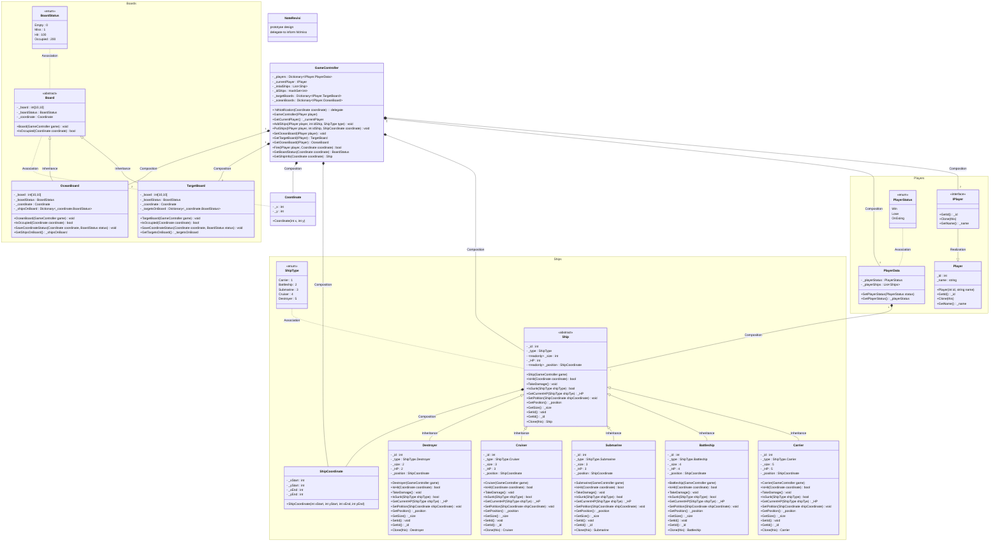

```mermaid
classDiagram
    Ship <|-- Carrier : Inheritance
    Ship <|-- Battleship : Inheritance
    Ship <|-- Submarine : Inheritance
    Ship <|-- Cruiser : Inheritance
    Ship <|-- Destroyer : Inheritance
    Ship *-- ShipCoordinate : Composition
    ShipType .. Ship : Association

    IPlayer --|> Player : Realization
    GameController "1" *-- "2" IPlayer : Composition
    GameController "1" *-- "2" PlayerData : Composition

    PlayerStatus .. PlayerData : Association

    
    GameController "1" *-- "2" TargetBoard : Composition
    GameController "1" *-- "2" OceanBoard : Composition
    GameController *-- Ship : Composition
    GameController *-- ShipCoordinate : Composition
    Board <|-- TargetBoard : Inheritance
    Board <|-- OceanBoard : Inheritance
    PlayerData "1" *-- "*" Ship : Composition


    BoardStatus .. Board : Association
    GameController *-- Coordinate : Composition
    Board .. Coordinate : Association


    namespace Ships{
    class Ship{
        <<abstract>>
        - _id : int
        - _type : ShipType
        - ~readonly~ _size : int
        - _HP : int
        - ~readonly~ _position : ShipCoordinate
        +Ship(GameController game)
        +IsHit(Coordinate coordinate) bool
        +TakeDamage() void
        +IsSunk(ShipType shipType) bool
        +GetCurrentHP(ShipType shipTye) _HP
        +SetPotition(ShipCoordinate shipCoordinate) void
        +GetPosition() _position
        +GetSize() _size
        +SetId() void
        +GetId() _id
        +Clone(this) Ship
        
    }
    class Carrier{
        - _id : int
        - _type : ShipType.Carrier
        - _size : 5
        - _HP : 5
        - _position : ShipCoordinate
        +Carrier(GameController game)
        +IsHit(Coordinate coordinate) bool
        +TakeDamage() void
        +IsSunk(ShipType shipType) bool
        +GetCurrentHP(ShipType shipTye) _HP
        +SetPotition(ShipCoordinate shipCoordinate) void
        +GetPosition() _position
        +GetSize() _size
        +SetId() void
        +GetId() _id
        +Clone(this) Carrier
    }
    class Battleship{
        - _id : int
        - _type : ShipType.Battleship
        - _size : 4
        - _HP : 4
        - _position : ShipCoordinate
        +Battleship(GameController game)
        +IsHit(Coordinate coordinate) bool
        +TakeDamage() void
        +IsSunk(ShipType shipType) bool
        +GetCurrentHP(ShipType shipTye) _HP
        +SetPotition(ShipCoordinate shipCoordinate) void
        +GetPosition() _position
        +GetSize() _size
        +SetId() void
        +GetId() _id
        +Clone(this) Battleship
    }
    class Submarine{
        - _id : int
        - _type : ShipType.Submarine
        - _size : 3
        - _HP : 3
        - _position : ShipCoordinate
        +Submarine(GameController game)
        +IsHit(Coordinate coordinate) bool
        +TakeDamage() void
        +IsSunk(ShipType shipType) bool
        +GetCurrentHP(ShipType shipTye) _HP
        +SetPotition(ShipCoordinate shipCoordinate) void
        +GetPosition() _position
        +GetSize() _size
        +SetId() void
        +GetId() _id
        +Clone(this) Submarine
    }
    class Cruiser{
        - _id : int
        - _type : ShipType.Cruiser
        - _size : 3
        - _HP : 3
        - _position : ShipCoordinate
        +Cruiser(GameController game)
        +IsHit(Coordinate coordinate) bool
        +TakeDamage() void
        +IsSunk(ShipType shipType) bool
        +GetCurrentHP(ShipType shipTye) _HP
        +SetPotition(ShipCoordinate shipCoordinate) void
        +GetPosition() _position
        +GetSize() _size
        +SetId() void
        +GetId() _id
        +Clone(this) Cruiser
    }
    class Destroyer{
        - _id : int
        - _type : ShipType.Destroyer
        - _size : 2
        - _HP : 2
        - _position : ShipCoordinate
        +Destroyer(GameController game)
        +IsHit(Coordinate coordinate) bool
        +TakeDamage() void
        +IsSunk(ShipType shipType) bool
        +GetCurrentHP(ShipType shipTye) _HP
        +SetPotition(ShipCoordinate shipCoordinate) void
        +GetPosition() _position
        +GetSize() _size
        +SetId() void
        +GetId() _id
        +Clone(this) Destroyer
    }
    class ShipCoordinate{
        - _xStart : int
        - _yStart : int
        - _xEnd : int
        - _yEnd : int
        +ShipCoordinate(int xStart, int yStart, int xEnd, int yEnd)

    }
    class ShipType{
        <<enum>>
        Carrier : 1
        Battleship : 2
        Submarine : 3
        Cruiser : 4
        Destroyer : 5
    }

    }


    namespace Players{
    class IPlayer{
        <<interface>>
        +GetId() _id
        +Clone(this)
        +GetName() _name
    }
    class Player{
        _id : int
        _name : string
        +Player(int id, string name)
        +GetId() _id
        +Clone(this)
        +GetName() _name
    }


    class PlayerData{
        - _playerStatus : PlayerStatus
        - _playerShips : List~Ships~
        +SetPlayerStatus(PlayerStatus status)
        +GetPlayerStatus() _playerStatus
    }

    class PlayerStatus{
        <<enum>>
        Win
        Lose
        OnGoing
    }
    


    }


    class Coordinate{
        - _x : int
        - _y : int
        +Coordinate(int x, int y)
    }

    namespace Boards{
        
    class BoardStatus{
        <<enum>>
        Empty : 0
        Miss : 1
        Hit : 100     
        Occupied : 200
    }
    class Board{
        <<abstract>>
        - _board : int[10,10]
        - _boardStatus : BoardStatus
        - _coordinate : Coordinate
        +Board(GameController game) void
        +IsOccupied(Coordinate coordinate) bool
       
    }
    class OceanBoard{
        - _board : int[10,10]
        - _boardStatus : BoardStatus
        - _coordinate : Coordinate
        - _shipsOnBoard : Dictionary~_coordinate.BoardStatus~
        +OceanBoard(GameController game) void
        +IsOccupied(Coordinate coordinate) bool
        +SaveCoordinateStatus(Coordinate coordinate, BoardStatus status) void
        +GetShipsOnBoard() _shipsOnBoard

    }
    class TargetBoard{
        - _board : int[10,10]
        - _boardStatus : BoardStatus
        - _coordinate : Coordinate
        - _targetsOnBoard : Dictionary~_coordinate.BoardStatus~
        +TargetBoard(GameController game) void
        +IsOccupied(Coordinate coordinate) bool
        +SaveCoordinateStatus(Coordinate coordinate, BoardStatus status) void
        +GetTargetsOnBoard() _targetsOnBoard
    }

    }


    class GameController{
        - _players : Dictionary~IPlayer.PlayerData~
        - _currentPlayer : IPlayer
        - _intialShips : List~Ship~
        - _idShips : HashSet~int~
        - _targetBoards : Dictionary~IPlayer.TargetBoard~
        - _oceanBoards : Dictionary~IPlayer.OceanBoard~
        + hitNotification(Coordinate coordinate) : delegate
        +GameController(IPlayer player)
        +GetCurrentPlayer() _currentPlayer
        +AddShips(IPlayer player, int idShip, ShipType type) void
        +PutShips(IPlayer player, int idShip, ShipCoordinate coordinate) void
        +SetOceanBoard(IPlayer player) void
        +GetTargetBoard(IPlayer) TargetBoard
        +GetOceanBoard(IPlayer) OceanBoard
        +Fire(IPlayer player, Coordinate coordinate) bool
        +GetBoardStatus(Coordinate coordinate) BoardStatus
        +GetShipInfo(Coordinate coordinate) Ship
        
    }
    class NoteRevisi{
        prototyoe design
        delegate to inform hit/miss
    }
```