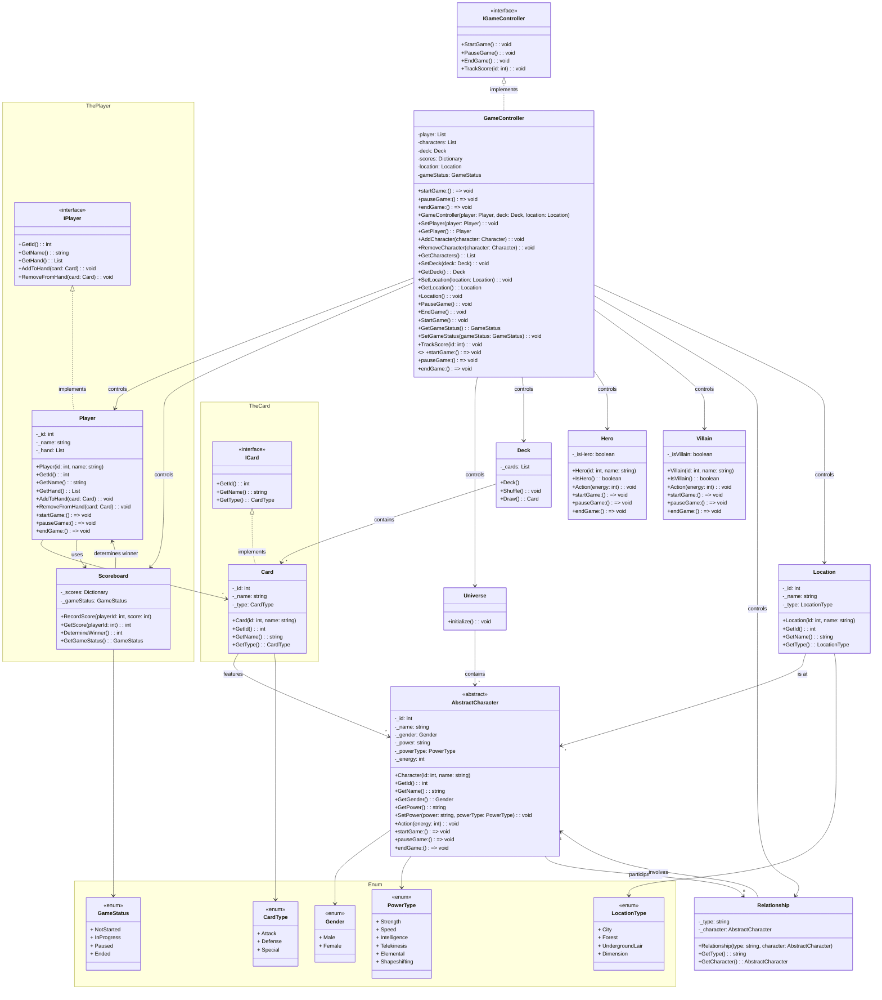

```mermaid
classDiagram

namespace Enum {
  class Gender {
  <<enum>>
    + Male
    + Female
  }

  class PowerType {
  <<enum>>
    + Strength
    + Speed
    + Intelligence
    + Telekinesis
    + Elemental
    + Shapeshifting
  }

  class LocationType {
  <<enum>>
    + City
    + Forest
    + UndergroundLair
    + Dimension
  }

  class CardType {
  <<enum>>
    + Attack
    + Defense
    + Special
  }

  class GameStatus {
    <<enum>>
     + NotStarted
     + InProgress
     + Paused
     + Ended
  }
}

class IGameController {
    <<interface>>
   +StartGame(): void
   +PauseGame(): void
   +EndGame(): void
   +TrackScore(id: int): void
}

class GameController {
  -player: List<Player>
  -characters: List<Character>
  -deck: Deck
  -scores: Dictionary<int, int>
  -location: Location
  -gameStatus: GameStatus
  +startGame: () => void
  +pauseGame: () => void
  +endGame: () => void

  +GameController(player: Player, deck: Deck, location: Location)
  +SetPlayer(player: Player): void
  +GetPlayer(): Player
  +AddCharacter(character: Character): void
  +RemoveCharacter(character: Character): void
  +GetCharacters(): List<Character>
  +SetDeck(deck: Deck): void
  +GetDeck(): Deck
  +SetLocation(location: Location): void
  +GetLocation(): Location
  +Location(): void
  +PauseGame(): void
  +EndGame(): void
  +StartGame(): void
  +GetGameStatus(): GameStatus
  +SetGameStatus(gameStatus: GameStatus): void
  +TrackScore(id: int): void
    <<delegates>> +startGame: () => void
     +pauseGame: () => void
     +endGame: () => void
}

IGameController <|.. GameController : implements

namespace ThePlayer {
  class IPlayer {
    <<interface>>
     +GetId(): int
     +GetName(): string
     +GetHand(): List<Card>
     +AddToHand(card: Card): void
     +RemoveFromHand(card: Card): void
  }

  class Player {
    -_id: int
    -_name: string
    -_hand: List<Card>
    +Player(id: int, name: string)
    +GetId(): int
    +GetName(): string
    +GetHand(): List<Card>
    +AddToHand(card: Card): void
    +RemoveFromHand(card: Card): void
    +startGame: () => void
    +pauseGame: () => void
    +endGame: () => void
  }

  class Scoreboard {
    -_scores: Dictionary<int, int>
    -_gameStatus: GameStatus
    +RecordScore(playerId: int, score: int)
    +GetScore(playerId: int): int
    +DetermineWinner(): int
    +GetGameStatus(): GameStatus
  }
}

IPlayer <|.. Player : implements

namespace TheCard {
  class ICard {
  <<interface>>
     +GetId(): int
     +GetName(): string
     +GetType(): CardType
  }

  class Card {
    -_id: int
    -_name: string
    -_type: CardType
    +Card(id: int, name: string)
    +GetId(): int
    +GetName(): string
    +GetType(): CardType
  }
}

ICard <|.. Card : implements

class Deck {
  -_cards: List<Card>
  +Deck()
  +Shuffle(): void
  +Draw(): Card
}

 class AbstractCharacter {
    <<abstract>>
  -_id: int
  -_name: string
  -_gender: Gender
  -_power: string
  -_powerType: PowerType
  -_energy: int
  +Character(id: int, name: string)
  +GetId(): int
  +GetName(): string
  +GetGender(): Gender
  +GetPower(): string
  +SetPower(power: string, powerType: PowerType): void
  +Action(energy: int): void
  +startGame: () => void
  +pauseGame: () => void
  +endGame: () => void
}

class Hero {
  -_isHero: boolean
  +Hero(id: int, name: string)
  +IsHero(): boolean
  +Action(energy: int): void
  +startGame: () => void
  +pauseGame: () => void
  +endGame: () => void
}

class Villain {
  -_isVillain: boolean
  +Villain(id: int, name: string)
  +IsVillain(): boolean
  +Action(energy: int): void
  +startGame: () => void
  +pauseGame: () => void
  +endGame: () => void
}

class Location {
  -_id: int
  -_name: string
  -_type: LocationType
  +Location(id: int, name: string)
  +GetId(): int
  +GetName(): string
  +GetType(): LocationType
}

class Relationship {
  -_type: string
  -_character: AbstractCharacter
  +Relationship(type: string, character: AbstractCharacter)
  +GetType(): string
  +GetCharacter(): AbstractCharacter
}

class Universe {
    +initialize(): void
}

Universe --> "*" AbstractCharacter : contains
GameController --> Universe : controls
GameController --> Player : controls
GameController --> Deck : controls
GameController --> Scoreboard : controls
GameController --> Hero : controls
GameController --> Villain : controls
GameController --> Relationship : controls
GameController --> Location : controls
AbstractCharacter --> Gender
AbstractCharacter --> PowerType
AbstractCharacter --> "n" Relationship : participates in
Player --> "*" Card : has
Player --> Scoreboard : uses
Card --> "*" AbstractCharacter : features
Card --> CardType
Location --> "*" AbstractCharacter : is at
Location --> LocationType
Deck --> "*" Card : contains
Scoreboard --> Player : determines winner
Scoreboard --> GameStatus
Relationship --> "1" AbstractCharacter : involves
```