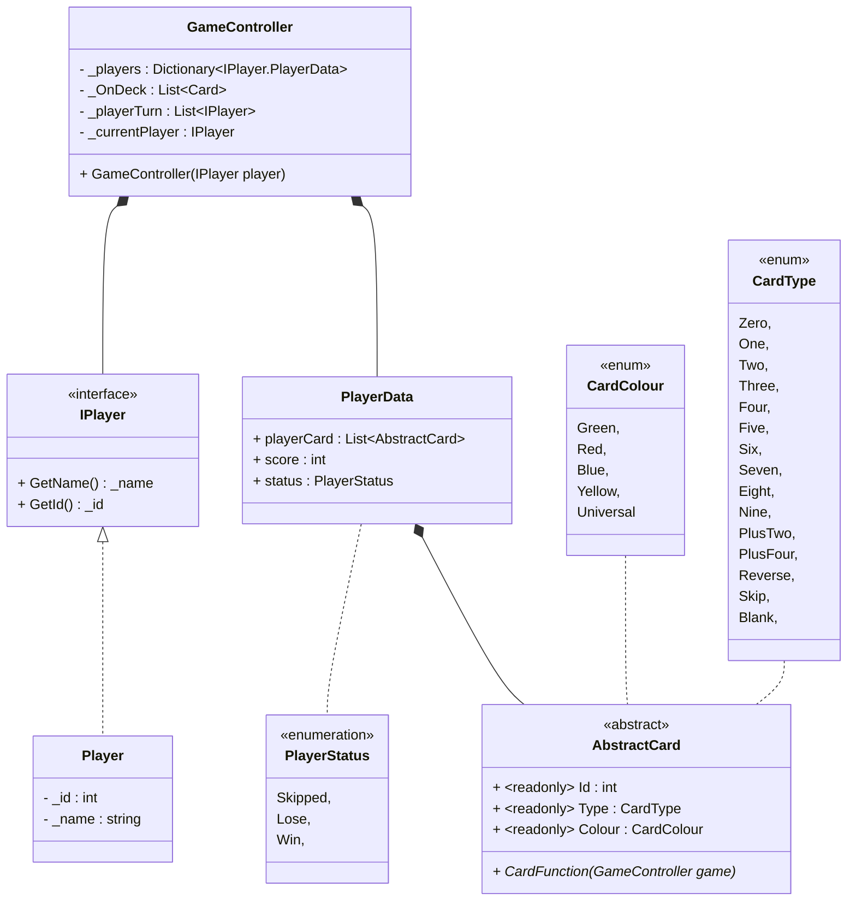

```mermaid
classDiagram 
GameController *-- IPlayer
GameController *-- PlayerData
PlayerData .. PlayerStatus
PlayerData *-- AbstractCard
IPlayer <|.. Player
CardColour .. AbstractCard
CardType .. AbstractCard
class IPlayer{
    <<interface>>
    + GetName() _name
    + GetId() _id
}
class Player {
    - _id : int
    - _name : string
}
class AbstractCard{
    <<abstract>>
    + ~readonly~ Id : int 
    + ~readonly~ Type : CardType
    + ~readonly~ Colour : CardColour
    + CardFunction(GameController game)*
}
class CardColour {
    <<enum>>
    Green,
	Red,
	Blue,
	Yellow,
	Universal
}
class CardType {
    <<enum>>
	Zero,
	One,
	Two,
	Three,
	Four,
	Five,
	Six,
	Seven,
	Eight,
	Nine,
	PlusTwo,
	PlusFour,
	Reverse,
	Skip,
	Blank,
}
class GameController{
    - _players : Dictionary~IPlayer.PlayerData~
    - _OnDeck : List~Card~
    - _playerTurn : List~IPlayer~
    - _currentPlayer : IPlayer
    + GameController(IPlayer player)
}
class PlayerData {
    + playerCard : List~AbstractCard~
    + score : int
    + status : PlayerStatus
}
class PlayerStatus {
    <<enumeration>>
    Skipped,
    Lose,
    Win,
}
```